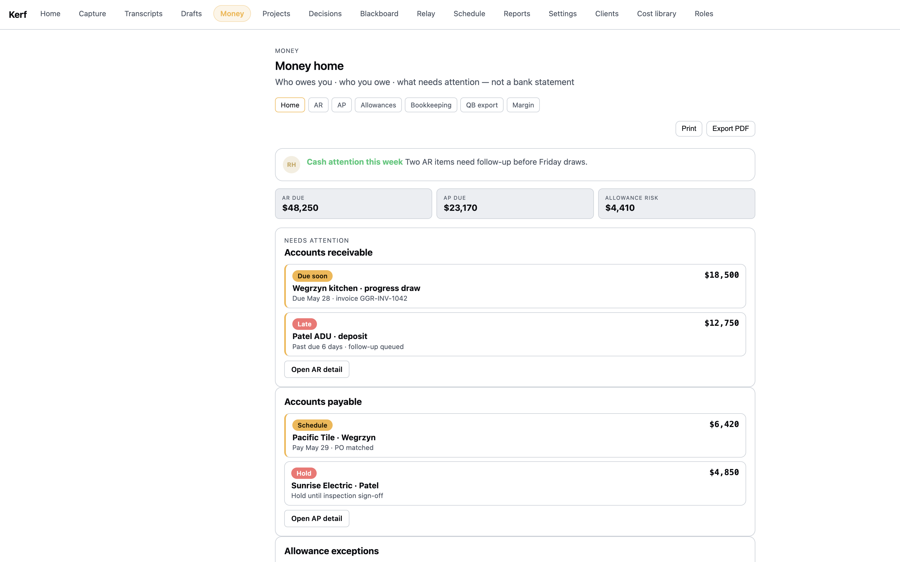
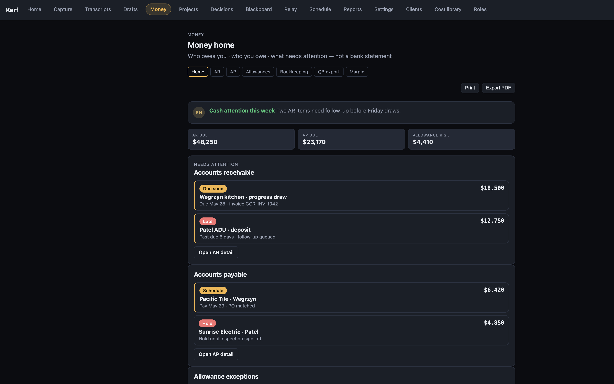
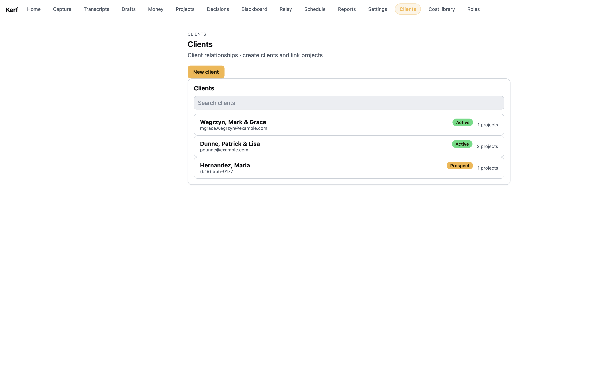
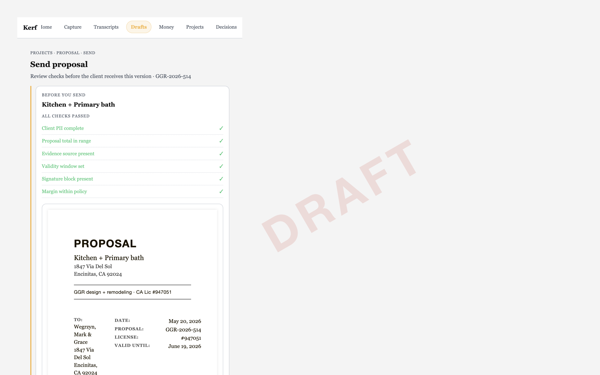
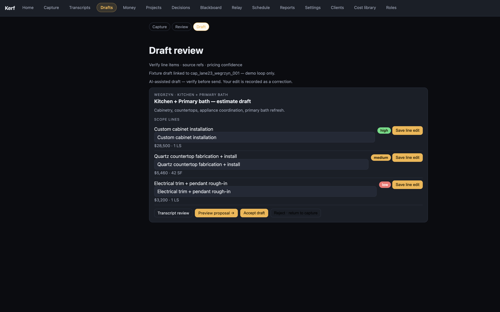

# Phase 1J · Agent D — Money + Proposal + Clients Visual Fidelity

**Agent:** D (Phase 1J)
**Branch:** `phase-1j-d-money-proposal-clients-visual-fidelity`
**Base:** `origin/main` @ `fa2e486` (independent — no stacking required)
**Date:** 2026-05-28
**Merge:** Do not merge (gate branch only)

---

## Goal

Make Money, Proposal, and Clients read like canon Kerf operating software, not
generic admin cards — by consuming the existing `--kerf-*` token palette instead
of frozen hardcoded hex, and by fixing the solid-chip contrast primitive that
the canon surfaces depend on. Visual fidelity only; no behavior, no money-write,
no new mutations.

## Branch posture

| Field | Value |
|-------|--------|
| **Mode** | **Independent** on `origin/main` @ `fa2e486` |
| **Stack base** | None — branches directly off `origin/main` |
| **Dependencies on other branches** | None |
| **Shared files touched** | `Chip.astro`, `RhSummary.astro`, `lane23.css` (also used by project detail) — color/contrast only, no structural change |

These changes are CSS/token-level and additive; they do not depend on any other
in-flight Phase 1J batch.

---

## Required primitive fix — solid chip contrast

**Bug:** `Chip.astro` forced `color: #fff` on every solid chip. The shell remaps
`--chip-amber → --kerf-amber (#F5B544)` and `--chip-green → --kerf-green
(#4ADE80)` — both bright — so white text on amber/green failed contrast badly,
and cyan (`--kerf-blue #7BA8FF`) had the same problem.

**Fix (`src/app/components/Chip.astro`):**

- Bright fills (amber / green / cyan) now take a **dark foreground** via the
  existing `--on-accent` token (`#1a1300`). A solid chip carries its own fill,
  so dark-on-bright reads identically across the light **and** dark theme
  cascade — more robust than the canon tint-text style, which only reads on dark.
- **Red retains its white "block" foreground** and neutral keeps white on the
  muted slate fill, per the brief ("preserving red/block contrast").
- Foregrounds are set **per tone** (not via a blanket `color:#fff` rule) so the
  `.chip-outlined` overrides still win on specificity — the previous blanket rule
  `.chip:not(.chip-outlined)` (specificity 0,2,0) would otherwise have beaten the
  per-tone color (0,1,0) and silently kept chips white.
- Fallback hexes for amber/green/cyan were realigned to the bright canon values
  so the component is self-consistent even without the global token sheet.
- **Layout fix:** `.chip` was `inline-flex` inside column-flex parents (money
  rows), which stretched it into a full-width *bar*. Added `align-self:
  flex-start; width: fit-content; max-width: 100%` so the chip stays a small pill
  — the single biggest "looks like canon, not an admin card" win (see before/after
  money screenshots).

Contrast after fix (approx WCAG ratios):

| Tone | Fill | Foreground | Ratio |
|------|------|-----------|-------|
| amber | `#F5B544` | `--on-accent #1a1300` | ~9.5 ✓ |
| green | `#4ADE80` | `--on-accent #1a1300` | ~8.9 ✓ |
| cyan | `#7BA8FF` | `--on-accent #1a1300` | ~8.1 ✓ |
| red | `#F87171` | `#fff` (preserved) | ~2.6 — block tone, intentionally unchanged per brief |
| neutral | `#6A7282` | `#fff` | ~4.0 ✓ |

This primitive is shared, so the fix also corrects every other solid-chip use in
the app (room-capture, field-detail scope flag, project audit panel, projects
list, work orders) without per-page repaint.

---

## Canon files used

| Canon | Used for |
|-------|----------|
| `docs/wireframes/canon/F-MN1_mobile_money_home.html` | Money home chrome, soft status-chip semantics (amber/green/red), attention border, RH summary, action-queue framing |
| `docs/wireframes/canon/F-MN2_desktop_money_home.html` | Desktop money home layout reference |
| `docs/wireframes/canon/F-PV1_mobile_proposal_view.html` / `F-PV2_desktop_proposal_view.html` | Proposal preview + send-gate chrome, operator segmented bar, paper-preview surround |
| `docs/wireframes/canon/F-CL1…F-CL6` (clients list/detail/record) | Clients list rows, status chips, new-client form |
| `docs/wireframes/canon/F-BK1a/b`, `F-BK2` | Bookkeeping / QB-export panels |
| `docs/wireframes/canon/F-E1_mobile_field_capture.html` | Source of the `--kerf-*` token palette (via `shell.css`) — the single palette every surface now consumes |

Token source of truth: `src/app/styles/shell.css` (`--kerf-*`, `--field-green`,
`--right-hand`, `--on-accent`, generic `--bg/--surface/--text/--border/--accent`
remapped onto canon). No second palette introduced.

---

## Surfaces changed

| Surface | File | Change |
|---------|------|--------|
| Chip primitive | `src/app/components/Chip.astro` | Readable solid foregrounds + pill layout fix (see above) |
| Right Hand summary | `src/app/components/RhSummary.astro` | Green headline text → `--field-green` token (was `--chip-green` fallback `#027a48`) |
| `/money` + all money subpages | `src/app/styles/money.css` | `.money-btn.primary` foreground → `--on-accent`; owner-private margin banner `#7c5bd8` → `--kerf-violet` token |
| `/proposals/[id]/preview` + `/send`, `/clients`, `/clients/[id]`, `/clients/new` | `src/app/styles/lane6.css` | Removed frozen dark hex (`#14181f`, `#e8ecf1`, `#c9a961`, `#1a1f28`, `#2a3140`, `#6a7282`, `#f5b544`, `#1a1300`, `#027a48`, `#b42318`, `#0f766e`) → `--kerf-bg-2`, `--text`, `--right-hand`, `--surface`, `--border`, `--kerf-text-mute`, `--accent`, `--on-accent`, `--field-green`, `--kerf-red`. Operator bar / segmented control / gate list / override panel / primary buttons / client-row hover all theme-aware now. Form + search inputs themed (`--surface-2` / `--text`). Preview chip right-aligned + `--right-hand` tinted. |
| `/clients` search box | `src/app/pages/clients/index.astro` | Bare `<input type=search>` given `.lane6-search` class |
| `/draft-review/[draft_id]` | `src/app/styles/lane23.css` | Edit-row inputs themed (`--surface-2` / `--text`) so they don't render as UA-white boxes on the dark theme |
| `/projects/new` | (no change needed) | Already consumes `money.css` tokens; shared create chrome inherits the `.money-btn.primary` + input fixes |

The paper-preview sheet (`.lane6-paper-html`) intentionally stays light on both
themes — it is a rendered proposal document, not app chrome.

---

## Buttons / loops preserved (no dead, no new mutations)

- **Money:** AR/AP detail links, nav pills, Export/Print (`ExportActions`, audit-logged), QB IIF export — all unchanged. Bookkeeping "Confirm match" remains an **honestly disabled** button with a Preview badge (no money-write).
- **Proposal send (`F-PV2`):** send-gate evaluation, override panel, and the
  explicit operator **"Send to client"** button are byte-for-byte unchanged.
  Send remains operator-confirmed; gate logic and the `/api/v1/proposals/:id/send`
  contract untouched. Verified by `lane6-prep` + `phase1i-batch-c` suites.
- **Draft review:** Save line edit / Accept / Reject / Preview proposal loops and
  their fetch contracts unchanged.
- **Clients:** New client form submit, client-detail project fetch, new-project
  link — unchanged. Fail-closed guards (`if (!id) redirect`, `proposal === null`
  redirect) left intact.

No `console.*` debug chrome added; no validators bypassed; no event contracts
rewritten.

---

## Preview-only areas (unchanged, still honest)

- Money **Bookkeeping** "Confirm match" — disabled + `action.preview.badge`.
- These were already correct; this pass did not touch their behavior, only
  ensured the surrounding chrome reads from tokens.

---

## Safety rails — confirmed held

| Rail | Status |
|------|--------|
| No money-write from UI | ✅ no mutation added; bookkeeping confirm stays disabled |
| No pay/finalize/send/approve mutation added | ✅ visual-only diff |
| Proposal send explicit operator-confirmed | ✅ send button + gate untouched |
| Fail closed on missing binding | ✅ existing `redirect('/')` / `redirect('/clients')` guards intact |
| No validator bypass | ✅ |
| No event-contract rewrite | ✅ |
| Single palette only | ✅ all colors now `--kerf-*` / `--field-green` / `--right-hand` / `--on-accent`; no new palette |

---

## Screenshots / browser-smoke

Served the built app via `scripts/serve-kerf-shell.ts` and verified each surface
in **both** light and dark theme (theme via `data-theme` on `<html>`, the canon
cascade). The `route-shell-smoke` suite additionally renders every in-scope route
(`/money`, `/money/*`, `/proposals/:id/preview`, `/proposals/:id/send`,
`/clients`, `/clients/:id`, `/clients/new`, `/projects/new`) with no 5xx.

| Surface | Screenshot |
|---------|-----------|
| Money home (light) — chips are readable pills, not bars | `assets/phase-1j-d/money-light.png` |
| Money home (dark) — canon F-MN1 look | `assets/phase-1j-d/money-dark.png` |
| Clients list — green Active / amber Prospect chips | `assets/phase-1j-d/clients-light.png` |
| Proposal send — green gate checks + explicit send | `assets/phase-1j-d/proposal-send-light.png` |
| Draft review (dark) — high/medium/low confidence chips + themed inputs | `assets/phase-1j-d/draft-review-dark.png` |







---

## Tests (run from working tree)

```bash
npm run typecheck          # exit 0
npm run build:astro        # exit 0
node --import tsx --test \
  tests/phase1i-batch-c-money-proposal-client.test.ts \
  tests/lane6-prep.test.ts \
  tests/route-shell-smoke.test.ts   # 15/15 pass, exit 0
```

## Clean-worktree proof

Verification was taken from a **fresh `git worktree` checked out at the pushed
remote tip** — not the agent's working tree.

```bash
git fetch origin phase-1j-d-money-proposal-clients-visual-fidelity
git worktree add --detach /private/tmp/kerf-1j-d-clean \
  origin/phase-1j-d-money-proposal-clients-visual-fidelity
cd /private/tmp/kerf-1j-d-clean
npm ci --ignore-scripts
npm run typecheck
npm run build:astro
node --import tsx --test \
  tests/phase1i-batch-c-money-proposal-client.test.ts \
  tests/lane6-prep.test.ts \
  tests/route-shell-smoke.test.ts
```

| Field | Value |
|-------|--------|
| Code commit verified | `543c1f616dc5f33708092f283e70fca4c6f6545e` |
| Matches `origin/phase-1j-d-money-proposal-clients-visual-fidelity` | Yes |
| `git status --porcelain` (excl. `node_modules/`) | clean |
| `npm ci --ignore-scripts` | exit 0 |
| `npm run typecheck` | exit 0 |
| `npm run build:astro` | exit 0 |
| focused tests (3 suites) | 15/15 pass · exit 0 |
| Proof UTC | `2026-05-29T01:51Z` |

`Chip.astro` and the report are present in the clean tree. Full log on the gate
machine: `/private/tmp/kerf-1j-d-clean-proof-20260528-185111.txt`.

> Note: the report-tip commit below adds only this appendix on top of the verified
> code commit `543c1f6`; no source changed after clean verification.
