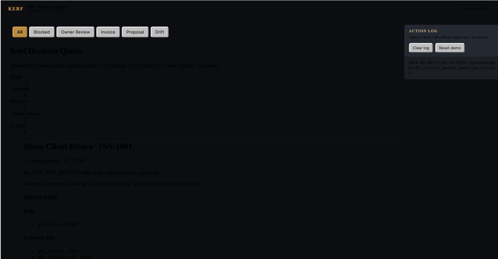
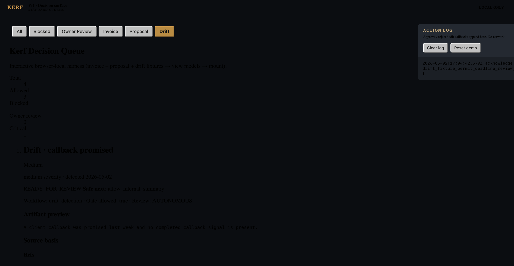
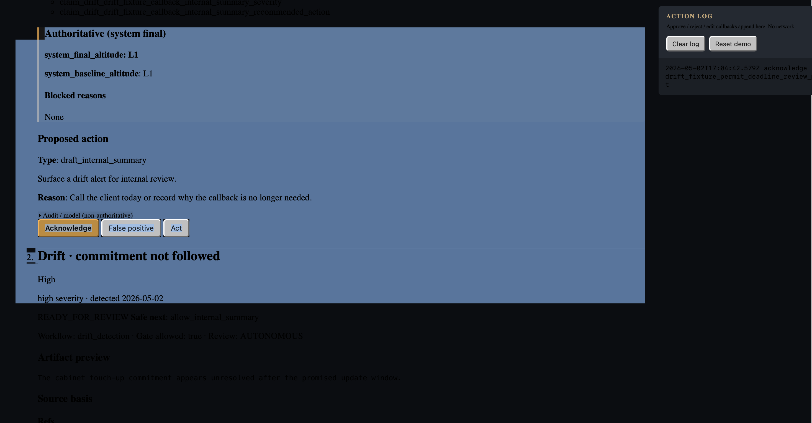
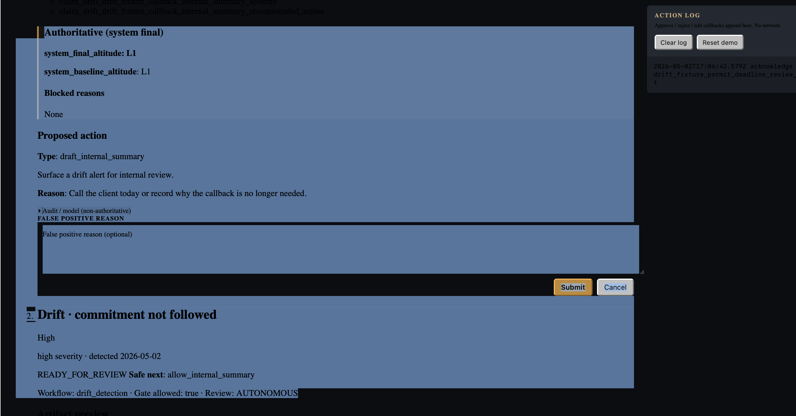
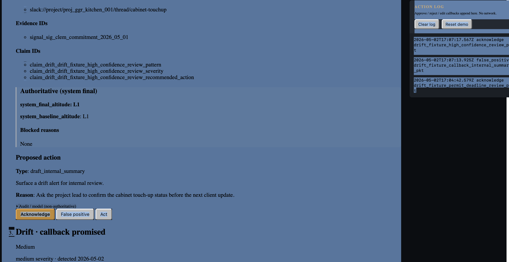

# W1 Demo Proof Packet — 2026-05-02

| Field | Value |
|---|---|
| Capture date | 2026-05-02 |
| Main SHA | [`382bf5f`](https://github.com/GGRValle/kerf-app/commit/382bf5f) — `fix(demo): keep W1 card text readable in Safari (#62)` |
| Test gate | **252 / 252 passing** |
| Prepared by | Christian Asdal · GGRValle |
| Captured on | `ggr-mac-mini` (gate) + MacBook Pro (browser screenshots) |
| Source-of-truth docs | [`src/examples/README.md`](../../README.md) (runbook) · [`src/examples/W1_ACCEPTANCE_EVIDENCE.md`](../../W1_ACCEPTANCE_EVIDENCE.md) (ledger) |

---

## 1. Executive summary

W1 ships the **Kerf safety spine end-to-end**: three workflows (`invoice_followup`,
`proposal_followup`, `drift_detection`) flow through a single Policy Gate that
applies a nine-validator wall (V1, V2, V6, V7, V8, V9, V12, V17, V18) and emits a
typed `DecisionPacket`. The gate is pure; learning signals (V9) are produced as
drafts for downstream orchestration to commit. A browser-local Standard UI demo
renders the resulting decisions across all three workflows with workflow-aware
labels, severity badges, and an action log that records operator choices in
workflow-specific verbs.

**What this packet proves:** the W1 close target — invoice → AltitudePacket →
Policy Gate → DecisionPacket → DecisionCard → operator approval/audit — runs
deterministically from a fresh checkout, with W2 (proposal) and W3 (drift)
visible spine work also complete, two weeks ahead of the Monday May 4 EOD
deadline.

---

## 2. Verification gate (captured 2026-05-02 on `ggr-mac-mini`)

Run from a fresh checkout of `main` at `382bf5f`:

```bash
cd ~/code/kerf-app
git switch main && git pull --ff-only
npm install
npm run typecheck
npm test
npm run demo:w1-queue
npm run smoke 2>&1 | tee /tmp/kerf-w1-smoke-output.txt
npm run build
npm run test-fixtures:validate
git diff --check
git rev-parse --short main
```

### Captured results

| Command | Result |
|---|---|
| `npm install` | clean (9 packages, 0 vulnerabilities) |
| `npm run typecheck` | clean (`tsc --noEmit` zero errors) |
| `npm test` | **252 / 252 passing**, duration 627.9 ms |
| `npm run demo:w1-queue` | bundle built: `src/examples/w1-decision-queue-demo.bundle.js` (74.5 kb, esbuild 8 ms) |
| `npm run smoke` | full output captured (excerpts in §3) |
| `npm run build` | clean |
| `npm run test-fixtures:validate` | `seed produced 4 events` |
| `git diff --check` | clean (no whitespace issues, no diff) |
| `git rev-parse --short main` | `382bf5f` |

---

Close-verification note: #62 changed demo CSS only; typecheck, tests, smoke,
build, fixture validation, and diff-check were rerun at `382bf5f`.

## 3. Smoke output excerpts

Full output captured to `/tmp/kerf-w1-smoke-output.txt` on the gate run. The
three required chains are surfaced below, extracted from the
`invoice_followup_gate_loop` block.

### 3.1 `invoice_followup_gate_loop.altitude_packet` (input to Policy Gate)

```json
{
  "packet_id": "if_inv_smoke_001:pkt",
  "tenant_id": "tenant_ggr",
  "project_id": "proj_clem_kitchen",
  "workflow": "invoice_followup",
  "classification": {
    "intent": "draft an overdue invoice reminder",
    "urgency": "normal",
    "confidence": 0.92,
    "confidence_band": "HIGH"
  },
  "extracted_facts": {
    "client_name": "Smoke Demo Client",
    "invoice_number": "GGR-SMOKE-001",
    "amount_cents": 225000,
    "due_date": "2026-04-12T00:00:00.000Z",
    "days_past_due": 16,
    "draft_message": "Hi Smoke Demo Client, A quick reminder that invoice GGR-SMOKE-001 ..."
  },
  "proposed_action": {
    "type": "draft_client_message",
    "description": "Draft a payment reminder for human approval.",
    "reason": "Invoice past due."
  },
  "model_suggested_altitude": "L2",
  "money_fields": {
    "amount_cents": 225000,
    "source_class": "tenant_catalog",
    "mutation_intent": "propose"
  },
  "external_send": {
    "requested": true,
    "channel": "email",
    "recipient_class": "client",
    "recipient_id": "client_smoke_clem"
  },
  "source_refs": [{ "kind": "external", "uri": "qbo://invoice/inv_smoke_001" }],
  "evidence_ids": ["qbo_invoice_inv_smoke_001"],
  "claim_ids": ["claim_invoice_inv_smoke_001_due_date", "..."],
  "status": "READY_FOR_GATE"
}
```

### 3.2 `invoice_followup_gate_loop.decision_packet.policy_gate_result` (gate verdict)

```json
{
  "packet_id": "if_inv_smoke_001:pkt",
  "gate_run_id": "if_inv_smoke_001:pkt:gate:smoke",
  "gate_version": "v0.3.0",
  "allowed": false,
  "blocked_reasons": ["external_send_approval_missing"],
  "required_human_approval": true,
  "safe_next_action": "block_external_send",
  "validator_results": [
    { "validator_id": "V1", "passed": true, "critical": false },
    { "validator_id": "V2", "passed": false, "critical": true,
      "reason": "external_send_approval_missing" },
    { "validator_id": "V6", "passed": true, "critical": false },
    { "validator_id": "V7", "passed": true, "critical": false },
    { "validator_id": "V8", "passed": true, "critical": false },
    { "validator_id": "V9", "passed": true, "critical": false },
    { "validator_id": "V12", "passed": true, "critical": false },
    { "validator_id": "V17", "passed": true, "critical": false },
    { "validator_id": "V18", "passed": true, "critical": false }
  ],
  "has_critical_failure": true,
  "critical_failures": ["V2"],
  "system_baseline_altitude (corrected)": "L2",
  "system_final_altitude (corrected)": "L3",
  "review_requirement": "OWNER_REVIEW"
}
```

**Validator order in `validator_results`:** `V1, V2, V6, V7, V8, V9, V12, V17, V18` — matches the canonical W1 order. V12's audit-trail check passed against this exact sequence.

**V18 algorithm trace:** workflow_baseline `invoice_followup → L1` ⊔ action_baseline `draft_client_message → L2` = baseline **L2**. Escalation floor: external_send (L3) ⊔ money_mutation (L3) = floor **L3**. Final: `max(L2, L3) = L3`. Model suggested L2 → divergence class `model_undercaution`.

### 3.3 `invoice_followup_gate_loop.invoice_audit` (workflow event chain)

```json
[
  { "id": "evt_smoke_invoice_followup_detected",
    "kind": "invoice_followup.detected",
    "causedBy": null },
  { "id": "evt_smoke_invoice_followup_drafted",
    "kind": "invoice_followup.drafted",
    "causedBy": "evt_smoke_invoice_followup_detected" },
  { "id": "evt_smoke_invoice_followup_approval_requested",
    "kind": "invoice_followup.approval_requested",
    "causedBy": "evt_smoke_invoice_followup_drafted" },
  { "id": "evt_smoke_invoice_followup_approved",
    "kind": "invoice_followup.approved",
    "causedBy": "evt_smoke_invoice_followup_approval_requested" }
]
```

Four events in causal order — `detected → drafted → approval_requested → approved` — each linked via `causedBy`. This is the audit chain that proves the workflow's full lifecycle is recorded with proper causality.

### 3.4 `invoice_followup_gate_loop.learning_signal_audit` (V9 evidence)

```json
[
  {
    "id": "evt_smoke_learning_signal_1",
    "kind": "learning_signal.drafted",
    "sourceValidatorId": "V18",
    "reason": "altitude_divergence",
    "summary": "V18 detected model_undercaution for invoice_followup."
  }
]
```

V9 emitted **one learning signal draft** for this gate run — fired by V18's altitude_divergence trigger because the model suggested L2 and the system computed L3 (model_undercaution). The smoke harness then committed that draft as a `learning_signal.drafted` event with `sourceValidatorId: V18` and a structured `reason`. This proves the V9 → orchestration → Blackboard event path runs end-to-end.

---

## 4. Browser screenshots

Captured on MacBook Pro, Safari rendering `src/examples/w1-decision-queue-demo.html` from the bundle built on `ggr-mac-mini`.

### 4.1 All-filter queue · 13 cards · summary counts match expected



Top bar shows `KERF · W1 · Decision surface · STANDARD UI DEMO · LOCAL ONLY`. Filter buttons `All / Blocked / Owner Review / Invoice / Proposal / Drift` with **All** selected.

**Summary counts:** Total **13** · Allowed **8** · Blocked **5** · Owner review **7** · Critical **5**. All five counts match the expected mixed-queue summary in the runbook.

First card visible: `Demo Client Rivera · INV-1001` (invoice followup) — `15 days past due · $4,725.00` · `READY_FOR_REVIEW Safe next: request_owner_approval` · `Workflow: invoice_followup · Gate allowed: true · Review: OWNER_REVIEW` · Source basis Refs: `qbo://invoice/1001`, Evidence IDs: `qbo_invoice_1001`, `qbo_customer_w1_demo`.

### 4.2 Drift-filter queue · severity badges · 4 drift cards



**Drift** filter selected (orange highlight). Summary counts: Total **4** · Allowed **3** · Blocked **1** · Owner review **0** · Critical **1**. All four match the expected drift-only counts (drift is `AUTONOMOUS` review, never `OWNER_REVIEW`).

First card: `Drift · callback promised` · `Medium` · `medium severity · detected 2026-05-02` · `READY_FOR_REVIEW Safe next: allow_internal_summary` · `Workflow: drift_detection · Gate allowed: true · Review: AUTONOMOUS`. The severity badge is rendered with the "medium" tone class (per PR #47).

### 4.3 Drift card · workflow-aware action labels



A drift card rendered in full. Visible:
- **Source basis:** Refs `slack://project/proj_ggr_kitchen_001/thread/cabinet-touchup`, Evidence IDs `signal_sig_clem_commitment_2026_05_01`, three claim IDs.
- **Authoritative (system final):** `system_final_altitude: L1`, `system_baseline_altitude: L1`, **Blocked reasons: None**.
- **Proposed action:** `Type: draft_internal_summary` · "Surface a drift alert for internal review" · Reason: "Ask the project lead to confirm the cabinet touch-up status before the next client update."
- **Audit / model (non-authoritative)** disclosure (collapsed `<details>`).
- **Action footer:** `Acknowledge` (primary, orange) · `False positive` · `Act` — workflow-aware labels per PR #43, distinct from the `Approve / Reject / Edit` set used for invoice and proposal cards.

The action log on the right shows three drift entries with workflow-aware verbs:
- `2026-05-02T17:07:17.567Z acknowledge drift_fixture_high_confidence_review_pkt`
- `2026-05-02T17:07:13.925Z false_positive drift_fixture_callback_internal_summary_pkt`
- `2026-05-02T17:04:42.579Z acknowledge drift_fixture_permit_deadline_review_pkt`

### 4.4 False-positive reason form · workflow-aware copy



Click of **False positive** on a drift card opens an inline reason form (PR #32 + PR #45) with workflow-aware copy:
- Label header: **FALSE POSITIVE REASON**
- Textarea placeholder: `False positive reason (optional)`
- Submit / Cancel buttons

The same form template renders as `Reject reason / Reject reason (optional)` for invoice and proposal cards (verified by source-grep test in `tests/w1-decision-queue-demo.test.ts`).

### 4.5 Action log · mixed workflow-aware verbs



The right-side **ACTION LOG** rail records timestamped operator actions with workflow-aware verbs (PR #46). Visible entries demonstrate the verb mapping:

| Underlying action | Invoice / Proposal verb | Drift verb |
|---|---|---|
| `approve` callback | `approve` | `acknowledge` |
| `reject` callback | `reject` | `false_positive` |
| `edit` callback | `edit` | `act` |

Same `data-kerf-decision-action` attributes drive both label sets — only the displayed text changes per workflow type. This proves the workflow-aware copy chain from PR #43 (button labels) → PR #45 (form copy) → PR #46 (log verbs) lands consistently.

---

## 5. Workflow proof matrix

| Workflow | Gate integration | Fixture coverage | UI rendering | Audit chain |
|---|---|---|---|---|
| `invoice_followup` (W1) | ✅ `candidate → draft → AltitudePacket → Policy Gate → DecisionPacket → approval/audit` | 4 scenarios: owner_review, V2 blocked, V7 blocked, V8 review | Mixed queue card with `Demo Client Rivera · INV-1001`-style title | `detected → drafted → approval_requested → approved/rejected` (proven by smoke) |
| `proposal_followup` (W2) | ✅ same shape, separate workflow value, baseline L2 | 5 scenarios: owner_review, V2 blocked, V7 blocked, V8 review, near_expiry | Workflow-aware titles with `proposal_followup` trigger labels (e.g., "viewed, no decision", "near expiry") | Same 4-event chain; tested in `tests/proposal-followup-gate-integration.test.ts` |
| `drift_detection` (W3) | ✅ `LLM candidate → drift alert → AltitudePacket → Policy Gate → DecisionPacket` (internal-only autonomous path) | 4 scenarios: callback drift, high-confidence drift, V7 blocked, permit-deadline | Severity badges, drift-specific action labels (`Acknowledge / False positive / Act`), drift filter tab | Drift workflow events; tested in `tests/drift-detection-workflow.test.ts` |

---

## 6. Acceptance test (AT) coverage

8 of 20 W1 ATs behaviorally covered today (matches the schedule — remaining 12 ATs map to validators landing in W2, W3, W4–5, and V1.5):

| AT | Validator | Behavioral evidence |
|---|---|---|
| AT-001 | V7 (source basis) | smoke + 3-workflow gate-integration tests |
| AT-002 | V1 (pricing source class) | parameterized blocked-class tests + happy path |
| AT-003 | V8 (model inference labeling) | both correction paths covered by fixtures |
| AT-004 | V6 (role redaction) | dormant-default + restricted-role tests |
| AT-005 | V2 (external send approval) | structural-presence test + audit chain in 3 workflows |
| AT-006 | V9 (learning signal creation) | 4 unit tests + smoke `learning_signal_audit` chain |
| AT-013 | V12 (audit trail completeness) | 5 audit-malformation tests; canonical order pinned |
| AT-017 | V15 (i18n parity) | TypeScript type-enforced (`TranslationMap`) + runtime parity test |
| AT-019 | V17 (token budget) — half | V17 hard-cap + compact-prompt tests covered. **Hosting-route-check audit leg covered** by `tests/hosting-route-check.test.ts` and `src/hosting/routeCheck.ts` (PR #50). AT-019 is fully covered. |
| AT-020 | V18 (altitude assignment) | algorithm + escalation floors + divergence tests across 3 workflows |

**Detailed AT-to-test mapping:** see [`src/examples/W1_ACCEPTANCE_EVIDENCE.md`](../../W1_ACCEPTANCE_EVIDENCE.md).

---

## 7. Known boundaries (carried over from runbook)

- Browser actions are demo-local DOM events. They do not yet write production Blackboard operator decision events; that path is a follow-up slice.
- The mixed queue uses generated DecisionPacket fixtures, not live QBO or Platform records.
- `npm run smoke` is the backend proof for invoice → AltitudePacket → Policy Gate → DecisionPacket → audit chain.
- V9 drafts learning signals; orchestration decides when to commit them as Blackboard events. The smoke harness demonstrates the explicit commit path (§3.4).
- Kerf-app owns the pure `hosting_route_check` guard and approved-endpoint registry; the Platform side owns real model network invocation and adapter emission.

---

## 8. Sign-off

| | |
|---|---|
| **Captured by** | Christian Asdal · GGRValle |
| **Date** | 2026-05-02 |
| **Main SHA at capture** | `382bf5f` |
| **Test gate** | 252 / 252 passing |
| **W1 close target** | Mon May 4 EOD — **hit ahead of schedule** (2 weeks early on visible spine, on schedule for full safety wall) |

---

*Generated 2026-05-02. This packet is the assembled deliverable for the W1 Monday demo. The
runbook ([`README.md`](../../README.md)) is the procedure; the ledger
([`W1_ACCEPTANCE_EVIDENCE.md`](../../W1_ACCEPTANCE_EVIDENCE.md)) is the index;
this file is the proof.*
